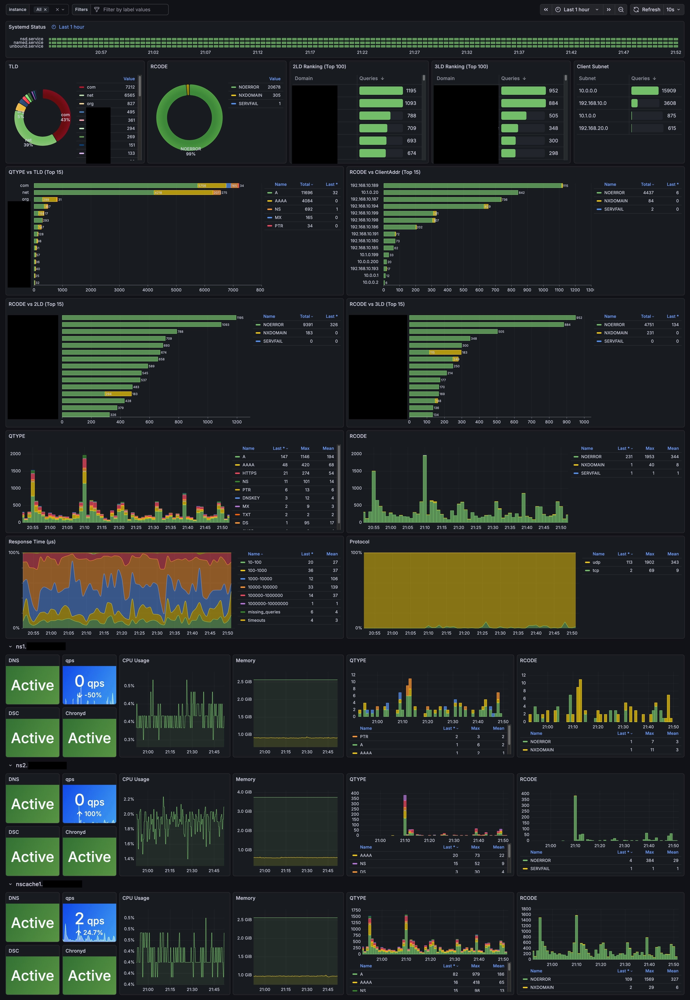

# dsc-prometheus-grafana

## Setup

### init

```bash
cp ./docker/.env.example ./docker/.env
```

### podman

```bash
sudo dnf install container-tools podman-tui podman-compose podman-docker -y
systemctl --user enable --now podman-restart podman.socket
sudo loginctl enable-linger $USER
echo "net.ipv4.ip_unprivileged_port_start=80" | sudo tee -a /etc/sysctl.conf
```

### dsc-datatool

```bash
git clone https://codeberg.org/DNS-OARC/dsc-datatool.git
cd dsc-datatool
python3 -m venv venv --system-site-packages
. venv/bin/activate
pip install -r requirements.txt
pip install -e . --no-deps
```

## Operation

### 環境変数変更後

```bash
docker compose up -d --force-recreate
```

### コンテナイメージのバージョンアップ

```bash
docker compose up -d --pull always --force-recreate
```

## docs

- <https://codeberg.org/DNS-OARC/dsc/src/branch/main>
- <https://codeberg.org/DNS-OARC/dsc-datatool>
- <https://dev.dns-oarc.net/packages/>

## Grafana Sample Dashboard


